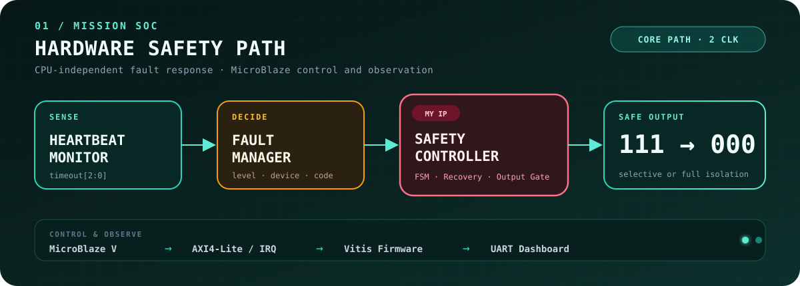

  

### 센서 입력을 실제 제어 동작으로 연결합니다.

RTOS Task·통신·상태 제어·FPGA SoC까지, 
**HW/SW 경계를 하나의 시스템으로 설계하고 검증합니다.**

  <a href="#engineering-focus">FOCUS</a> ·
  <a href="#01--mission-computer-health-monitoring--fault-response-soc">MISSION SoC</a> ·
  <a href="#selected-embedded-systems">PROJECTS</a> ·
  <a href="#education--qualifications">EDUCATION</a>

---

## Engineering Focus

| 01 · CORE | 02 · CONNECT | 03 · EXTEND |
|:---|:---|:---|
| **MCU Firmware** `C` · `STM32F4` · `ATmega128A` · `HAL` · `FSM` | **Real-time & Interfaces** `FreeRTOS` · `Task/Mutex` · `CAN` · `UART` · `I2C` | **FPGA SoC & Edge AI** `Verilog` · `MicroBlaze` · `AXI4-Lite` · `Vitis` · `YOLO/NCNN` |

> **DESIGN PRINCIPLE** — Task·상태·메시지의 경계를 먼저 정의하고, 센서–판단–구동의 흐름을 실제 하드웨어에서 검증합니다.

---

## 01 · Mission Computer Health-Monitoring & Fault-Response SoC

`FLAGSHIP SoC` · `3인 팀` · `Basys 3` · `MicroBlaze` · `Verilog HDL` · `AXI4-Lite` · `Vivado/Vitis`

3개 하위 장치의 Heartbeat와 Fault를 FPGA 하드웨어에서 병렬 감시하고, 고장 수준에 따라 `NORMAL / WARNING / DEGRADED / SAFE_MODE`로 출력을 전환하는 고신뢰 임베디드 시스템 교육용 프로토타입입니다.

  

- **MY PART — Safety Controller IP** — 4-state FSM, 고장 장치별 출력 격리, `SAFE_MODE` Latch와 Manual Recovery 구현
- **HW/SW Interface** — AXI4-Lite Register, Level IRQ·W1C, Core/AXI Testbench 설계
- **Deterministic Design** — 입력 확정 이후 Fault Manager → Safety Controller의 2클럭 대응 경로로 설계
- **Team Integration** — 3종 Custom IP, MicroBlaze/Vitis, AXI INTC·UARTLite·GPIO, PC 대시보드 기반 보드 통합 공동 수행

---

## Selected Embedded Systems

### 02 · [Object-Detecting Autonomous Taxi](https://github.com/pkt-gif/object-detecting-autonomous-taxi)

`3인 팀` · `STM32F446RE` · `FreeRTOS` · `CAN` · `Raspberry Pi 4` · `YOLO11n/NCNN`

Raspberry Pi 4의 객체 탐지 결과와 STM32의 초음파 센서 데이터를 결합해 차량의 `STOP / SLOW / GO` 상태를 제어한 자율주행 RC 택시 프로토타입입니다.

- **Architecture** — Raspberry Pi 4 ↔ STM32F446RE 간 CAN 메시지와 주행 상태 FSM 설계
- **Model Deployment** — Raspberry Pi 4 환경에 맞춰 320×320 YOLO11n NCNN 모델을 변환·적용
- **MY PART** — 전체 시스템 아키텍처, 교통 객체 6종 데이터셋, 센서 융합, 차동 구동 로직 구현

[Code ↗](https://github.com/pkt-gif/object-detecting-autonomous-taxi) · [Demo ▶](https://www.youtube.com/watch?v=wJaPBZJurDA)

### 03 · [FreeRTOS Autonomous Robotaxi](https://github.com/pkt-gif/robotaxi)

`개인 프로젝트` · `STM32F411RE` · `FreeRTOS` · `UART` · `PWM` · `HC-SR04`

센서 측정, 자율주행 판단, 수동 제어를 3개 Task로 분리하고 Bluetooth 앱으로 주행 모드를 전환하는 소형 모빌리티 시스템입니다.

- **Architecture** — `SensorTask / DriveTask / ManualTask`와 Mutex 기반 센서 데이터 공유
- **Control** — 3방향 초음파 거리 오차를 이용한 P 제어 방식의 차동 조향
- **Mode Handling** — `manual_mode` 조건으로 자율주행 Task와 Bluetooth 수동 명령의 실행 경로 분리

[Code ↗](https://github.com/pkt-gif/robotaxi) · [Demo ▶](https://www.youtube.com/shorts/1cFvFcStp3M) · [Autonomous Drive ▶](https://www.youtube.com/shorts/8N2YOQ3bM_4)

### 04 · [AXI4-Lite Custom Vending Machine](https://github.com/pkt-gif/custom-vending-machine)

`4인 팀` · `Basys 3` · `Verilog HDL` · `Vivado` · `AXI4-Lite` · `FSM`

주문·결제·재고·음료 배출을 RTL로 구현하고, AXI4-Lite Master/Slave 통신으로 결제 및 재고 데이터를 처리한 FPGA 시스템입니다.

- **Interface** — AXI4-Lite `AW/W/B/AR/R` 5개 채널의 `VALID/READY` Handshake 상태 로직 구현
- **Debugging** — `all_soldout` 신호를 Latch해 FSM의 품절 상태 유지 경로 보완
- **MY PART** — AXI4-Lite Master Interface, 버튼·스위치 UI, Basys 3 하드웨어 통합

[Code ↗](https://github.com/pkt-gif/custom-vending-machine) · [Demo ▶](https://www.youtube.com/watch?v=7eshwTPMTOo)

---

## More Embedded Work

| 프로젝트 | 핵심 구현 | 담당 |
|---|---|---|
| **[STM32 Lift Controller](https://github.com/pkt-gif/stm32-elevator)** [Demo](https://www.youtube.com/watch?v=AVxfVoIqJPs) | 키패드 인증, 스텝모터 승강, 포토인터럽터 상·하한 제한, UART 점검 명령 | 승강 제어, 범위 제한, LED·부저 피드백 |
| **[Smart Fish Tank](https://github.com/pkt-gif/Smart-fish-tank)** [Demo](https://www.youtube.com/watch?v=u2zzdcHJl2s) | LED ON/OFF 시 조도 센서 ADC 차분을 이용한 상대 탁도 상태 판정, RGB LED·I2C LCD 표시 | 측정·판정 로직, 상태 표시 |

---

## Education & Qualifications

- **대한상공회의소 경기인력개발원** — 온디바이스 AI 반도체 설계 과정 · 2026.02–2026.09 수료 예정
- **가천대학교 전자공학과** · 2018.02–2020.08
- **TOEIC Speaking IH** · **1종 보통 운전면허**

---

센서 하나의 값부터 시스템 전체의 상태 전이까지, 
**동작 근거를 코드와 검증 결과로 설명하는 엔지니어**가 되겠습니다.

