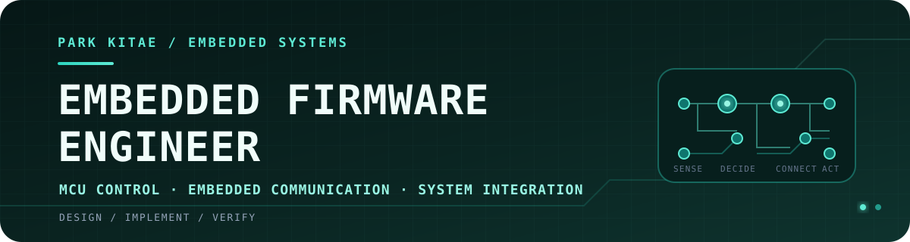

<p align="center">
  
</p>

<div align="center">

# 박기태

### Embedded Firmware Engineer

**From signals to systems.**  
MCU 펌웨어를 중심으로 RTOS·통신 시스템을 구현하며,  
MicroBlaze 기반 SoC와 Edge AI까지 HW/SW 경계를 확장하고 있습니다.

<p>
  <code>SENSE</code> → <code>DECIDE</code> → <code>COMMUNICATE</code> → <code>CONTROL</code> → <code>VERIFY</code>
</p>

<a href="mailto:pkikit95@gmail.com"></a>
<a href="https://github.com/pkt-gif"></a>

</div>

---

## Engineering Focus

| 01 · CORE | 02 · CONNECT | 03 · EXTEND |
|:---|:---|:---|
| **MCU Firmware**<br>`C` · `STM32F411/F446` · `ATmega128A` · `HAL` | **Real-time & Interfaces**<br>`FreeRTOS` · `Task/Mutex` · `FSM` · `CAN` · `UART` · `I2C` | **FPGA SoC & Edge AI**<br>`Verilog` · `MicroBlaze` · `AXI4-Lite` · `YOLO11n` · `NCNN` |

```text
MCU │ Sensors       → Task / FSM → CAN / UART → Motor / Display
SoC │ Fault / State  → Custom IP → AXI / IRQ  → MicroBlaze / Vitis
```

**How I build** — Task·상태·메시지의 경계를 먼저 정의하고, 센서–판단–구동의 흐름을 실제 하드웨어에서 끝까지 검증합니다.

---

## SoC & HW/SW Co-design

펌웨어가 사용하는 레지스터와 인터럽트의 동작 원리까지 이해하기 위해, MicroBlaze 기반 SoC에서 Custom IP·AXI 인터페이스·Vitis 펌웨어를 함께 설계하고 검증했습니다.

### 01 · Mission Computer Health-Monitoring & Fault-Response SoC

`3인 팀` · `Basys 3` · `Verilog HDL` · `MicroBlaze` · `AXI4-Lite` · `Vivado/Vitis` · `C` · `Python/PySide6`

3개 하위 장치의 Heartbeat와 Fault를 FPGA 하드웨어에서 병렬 감시하고, 고장 수준에 따라 `NORMAL / WARNING / DEGRADED / SAFE_MODE`로 출력을 전환하는 고신뢰 임베디드 시스템 교육용 프로토타입입니다.

- **My IP — Safety Controller** — 4-state FSM, 고장 장치별 출력 차단, `SAFE_MODE` Latch와 Manual Recovery 구현
- **Interface** — AXI4-Lite Register, Level IRQ와 W1C, Core·AXI Testbench 설계
- **Team Integration** — 3종 Custom IP, MicroBlaze/Vitis, AXI INTC·UARTLite·GPIO, PC 대시보드의 보드 통합 검증 공동 수행
- **Deterministic Path** — 입력 동기화 이후 Fault Manager 1clk + Safety Controller 1clk, 최대 20ns의 핵심 차단 경로를 RTL 파형으로 확인

<sub>Public repository and demo · preparing</sub>

## Embedded & Edge AI Projects

### 02 · [Object-Detecting Autonomous Taxi](https://github.com/pkt-gif/object-detecting-autonomous-taxi)

`3인 팀` · `STM32F446RE` · `FreeRTOS` · `CAN` · `Raspberry Pi 4` · `YOLO11n/NCNN`

Raspberry Pi 4의 객체 탐지 결과와 STM32의 초음파 센서 데이터를 결합해 차량의 `STOP / SLOW / GO` 상태를 제어한 자율주행 RC 택시 프로토타입입니다.

- **Model Conversion** — 640×640 ONNX 추론의 약 2초 지연을 분석하고 320×320 NCNN 모델로 경량화
- **System Design** — Raspberry Pi 4 ↔ STM32F446RE 간 CAN 메시지와 주행 상태 FSM 설계
- **Ownership** — 전체 시스템 아키텍처, 교통 객체 6종 데이터셋, 센서 융합, 차동 구동 로직 구현

[Repository](https://github.com/pkt-gif/object-detecting-autonomous-taxi) · [Demo](https://www.youtube.com/watch?v=wJaPBZJurDA)

### 03 · [FreeRTOS Autonomous Robotaxi](https://github.com/pkt-gif/robotaxi)

`개인 프로젝트` · `STM32F411RE` · `FreeRTOS` · `UART` · `PWM` · `HC-SR04`

센서 측정, 자율주행 판단, 수동 제어를 3개 Task로 분리하고 Bluetooth 앱으로 주행 모드를 전환하는 소형 모빌리티 시스템입니다.

- **RTOS Design** — `SensorTask / DriveTask / ManualTask`와 Mutex 기반 센서 데이터 공유
- **Control** — 3방향 초음파 거리 오차를 이용한 P 제어 방식의 차동 조향
- **Troubleshooting** — 자동·수동 제어 경로를 분리하고 모터 제어권을 단일화해 모드 충돌 해결

[Repository](https://github.com/pkt-gif/robotaxi) · [Demo](https://www.youtube.com/shorts/1cFvFcStp3M) · [Autonomous Drive](https://www.youtube.com/shorts/8N2YOQ3bM_4)

### 04 · [AXI4-Lite Custom Vending Machine](https://github.com/pkt-gif/custom-vending-machine)

`4인 팀` · `Basys 3` · `Verilog HDL` · `Vivado` · `AXI4-Lite` · `FSM`

주문·결제·재고·음료 배출을 RTL로 구현하고, AXI4-Lite Master/Slave 통신으로 결제 및 재고 데이터를 처리한 FPGA 시스템입니다.

- **Interface** — AXI4-Lite `AW/W/B/AR/R` 5개 채널의 `VALID/READY` Handshake 상태 로직 구현
- **Troubleshooting** — 1클럭 `all_soldout` 펄스 누락을 상태 유지 레지스터로 보완
- **Ownership** — AXI4-Lite Master Interface, 버튼·스위치 UI, Basys 3 하드웨어 통합

[Repository](https://github.com/pkt-gif/custom-vending-machine) · [Demo](https://www.youtube.com/watch?v=7eshwTPMTOo)

---

## More Embedded Work

| 프로젝트 | 핵심 구현 | 담당 |
|---|---|---|
| **[STM32 Lift Controller](https://github.com/pkt-gif/stm32-elevator)**<br>[Demo](https://www.youtube.com/watch?v=AVxfVoIqJPs) | 키패드 인증, 스텝모터 승강, 포토인터럽터 상·하한 제한, UART 점검 명령 | 승강 제어, 범위 제한, LED·부저 피드백 |
| **[Smart Fish Tank](https://github.com/pkt-gif/Smart-fish-tank)**<br>[Demo](https://www.youtube.com/watch?v=u2zzdcHJl2s) | LED ON/OFF 시 조도 센서 ADC 차분을 이용한 간이 수질 상태 판정, RGB LED·I2C LCD 표시 | 측정·판정 로직, 상태 표시 |

---

## Education & Qualifications

- **대한상공회의소 경기인력개발원** — 온디바이스 AI 반도체 설계 과정 · 2026.02–2026.09 수료 예정
- **가천대학교 전자공학과** · 2018.02–2020.08
- **TOEIC Speaking IH** · **1종 보통 운전면허**

---

<div align="center">

센서 하나의 값부터 시스템 전체의 상태 전이까지,  
**동작 근거를 코드와 검증 결과로 설명하는 엔지니어**가 되겠습니다.

</div>

<!--
TODO before publishing:
1. 가천대학교 학적 상태(졸업/수료/중퇴 등)를 확인해 Education 문구에 명시합니다.
2. 공개 포트폴리오 PDF URL이 준비되면 상단에 Portfolio 배지를 추가합니다.
3. Mission SoC 저장소·시연 링크가 준비되면 01 프로젝트에 연결합니다.
-->
