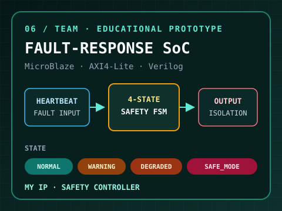

  

### STM32 Firmware · FreeRTOS · CAN

센서 데이터를 안정적으로 수집하고, 
**Task · FSM · 통신 구조를 통해 실제 제어 동작으로 연결하는 임베디드 펌웨어 엔지니어 박기태입니다.**

`SENSE` → `DECIDE` → `COMMUNICATE` → `CONTROL` → `VERIFY`

---

## Engineering Focus

| MCU FIRMWARE | REAL-TIME & I/O | SYSTEM EXTENSION |
|:---:|:---:|:---:|
| `C` `STM32F4` `HAL` `FSM` | `FreeRTOS` `Task/Mutex` `CAN` `UART` `I²C` `PWM` | `Edge AI` `FPGA SoC` |

> 상태와 메시지의 경계를 먼저 정의하고, 센서–판단–구동의 흐름을 실제 하드웨어에서 검증합니다.

---

## Built Systems

| **01 · [Object-Detecting Taxi](https://github.com/pkt-gif/object-detecting-autonomous-taxi)** FIRMWARE + EDGE AI · TEAM | **02 · [FreeRTOS Robotaxi](https://github.com/pkt-gif/robotaxi)** REAL-TIME FIRMWARE · SOLO |
|:---|:---|
|  |  |
| **FLOW** `YOLO/NCNN + Ultrasonic` → `Drive FSM` → `STOP / SLOW / GO` | **FLOW** `SensorTask` → `Mutex` → `DriveTask` |
| **MY PART** `Architecture` · `6-class Data` · `Sensor Fusion` | **BUILD** `3 Tasks` · `P Control` · `AUTO / MANUAL` |
| `STM32F446RE` `FreeRTOS` `CAN` `NCNN` | `STM32F411RE` `FreeRTOS` `UART` `PWM` |
| [Repository ↗](https://github.com/pkt-gif/object-detecting-autonomous-taxi) · [Demo ▶](https://www.youtube.com/watch?v=wJaPBZJurDA) | [Repository ↗](https://github.com/pkt-gif/robotaxi) · [Demo ▶](https://www.youtube.com/shorts/1cFvFcStp3M) · [Autonomous ▶](https://www.youtube.com/shorts/8N2YOQ3bM_4) |

| **03 · [STM32 Lift Controller](https://github.com/pkt-gif/stm32-elevator)** MCU CONTROL · TEAM | **04 · [Smart Fish Tank](https://github.com/pkt-gif/Smart-fish-tank)** EMBEDDED SENSING · TEAM |
|:---|:---|
|  |  |
| **FLOW** `Keypad + Limit` → `Control FSM` → `Lift / Door` | **FLOW** `LED ON/OFF ADC` → `Difference` → `Relative Turbidity` |
| **MY PART** `Motion Control` · `Safety Limit` · `LED/Buzzer` | **MY PART** `ADC Measurement` · `3-Level Decision` · `Status Display` |
| `STM32F411RE` `HAL` `UART/I²C` `Stepper` | `ATmega128A` `ADC` `I²C` `RGB LED` |
| [Repository ↗](https://github.com/pkt-gif/stm32-elevator) · [Demo ▶](https://www.youtube.com/watch?v=AVxfVoIqJPs) | [Repository ↗](https://github.com/pkt-gif/Smart-fish-tank) · [Demo ▶](https://www.youtube.com/watch?v=u2zzdcHJl2s) |

| **05 · [AXI4-Lite Vending Machine](https://github.com/pkt-gif/custom-vending-machine)** FPGA RTL · TEAM | **06 · Mission Computer Safety SoC** HW/SW CO-DESIGN · TEAM |
|:---|:---|
|  |  |
| **FLOW** `Order` → `AXI Master FSM` → `Stock / Dispense` | **FLOW** `Heartbeat / Fault` → `Safety FSM` → `Output Isolation` |
| **MY PART** `AXI Master` · `5-channel Handshake` · `Board UI` | **MY IP** `4-state FSM` · `SAFE_MODE Latch` · `Manual Recovery` |
| `Basys 3` `Verilog` `AXI4-Lite` `Vivado` | `MicroBlaze` `Verilog` `AXI4-Lite` `Vitis` |
| [Repository ↗](https://github.com/pkt-gif/custom-vending-machine) · [Demo ▶](https://www.youtube.com/watch?v=7eshwTPMTOo) | `Safety Controller IP` · `Educational Prototype` |

---

## Toolbox

`C` · `Python` · `STM32 HAL` · `FreeRTOS` · `CAN` · `UART` · `I²C` · `PWM` · `ADC` · `GPIO/EXTI` 
`Verilog HDL` · `Vivado` · `Vitis` · `MicroBlaze` · `AXI4-Lite` · `OpenCV` · `YOLO11n` · `NCNN`

## Education & Qualifications

- **대한상공회의소 경기인력개발원** — 온디바이스 AI 반도체 설계 과정 · 2026.02–2026.09 수료 예정
- **가천대학교 전자공학과** · 2018.02–2020.08
- **TOEIC Speaking IH** · **1종 보통 운전면허**

---

**동작 근거를 코드와 검증 결과로 설명하는 엔지니어가 되겠습니다.**

